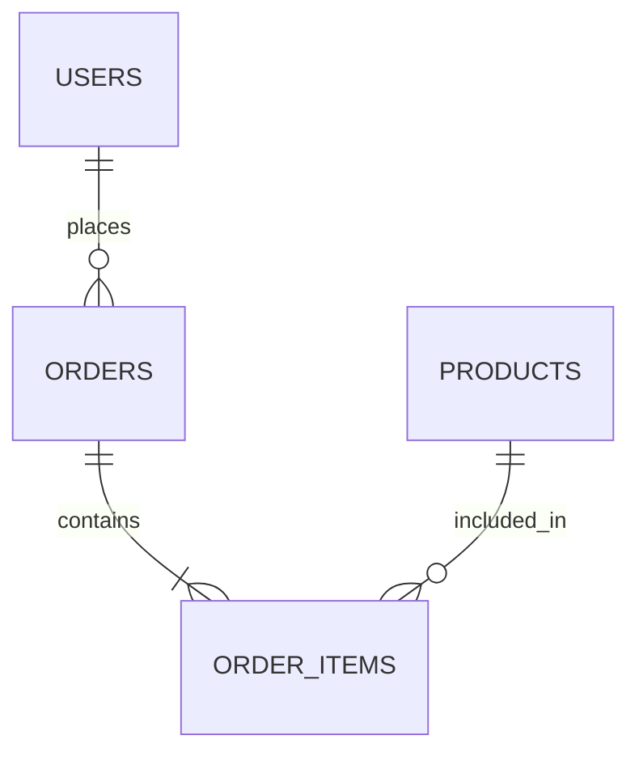

# ER Diagram & Relational Schema
Entities: USERS, PRODUCTS, ORDERS, ORDER_ITEMS.
Relationships: USERS 1:N ORDERS; ORDERS 1:N ORDER_ITEMS; PRODUCTS 1:N ORDER_ITEMS. Thus ORDERS and PRODUCTS have an M:N relationship resolved by ORDER_ITEMS.

Relational schema:
- USERS(id PK, name, email UNIQUE, password, segment, created_at)
- PRODUCTS(id PK, name, category, price, rating, stock, description, image)
- ORDERS(id PK, user_id FK->USERS.id, total, status, created_at)
- ORDER_ITEMS(id PK, order_id FK->ORDERS.id, product_id FK->PRODUCTS.id, quantity, price)

